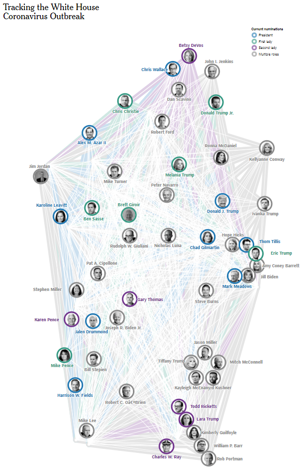

# coronavirus-d3-chart
Corona D3 chart- White House Coronavirus Outbreak Tracking

The Corona D3 chart is an open-source project for tracking the coronavirus outbreak in the United States, specifically focusing on data related to the White House. The chart is built using the D3.js library and is designed to provide a clear and easy-to-use visualization of the outbreak data.
**Features**

- Daily updated data on confirmed cases, deaths, and recovery rate.
- Data can be filtered by state.
- Data can be viewed in different time scales.
- Easy-to-use interface

**Getting started**

The project is hosted on GitHub and can be accessed by visiting the website. No additional setup is required.

To access the chart, simply visit the website and explore the various data visualizations.
Contributions

This project is open-source and welcomes contributions from the community. If you would like to contribute, please submit a pull request or report an issue on GitHub.

**Disclaimer**

Please note that the data provided on this chart is for informational purposes only and is not intended to be used for medical or clinical purposes. Always consult a healthcare professional for any medical advice.

This project is developed and maintained by a group of data enthusiasts and developers who are passionate about using data to understand and track the coronavirus outbreak. We hope that this tool can help people stay informed and make data-driven decisions.

# Resources:

https://www.nytimes.com/interactive/2020/10/02/us/politics/trump-contact-tracing-covid.html
